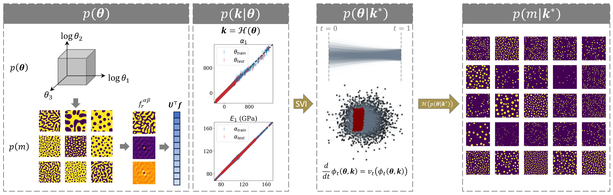
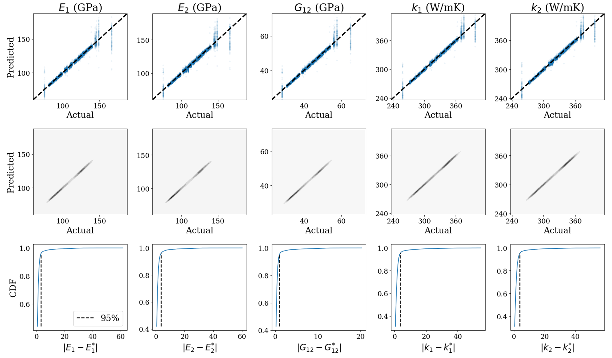

# Bayesian Approach to Designing Microstructures and Processing Pathways for Tailored Material Properties

[Paper](https://openreview.net/forum?id=zZPICTs5gB)

## Description

This repository contains research code associated with work entitled *"Bayesian Approach to Designing Microstructures and Processing Pathways for Tailored Material Properties"*. The proposed framework utilizes a conditional continuous normalizing flow (CNF) trained with the flow matching objective proposed by [Lipman *et al.* (2023)](https://arxiv.org/abs/2210.02747), and a composite process-structure and structure-property linkage as the forward model for implicitly learning the joint distribution between processing parameters and an arbitrary property set.

If you find this code useful, interesting, and are open to collaboration, please reach out!
Alternatively, if you have any questions regarding the contents of this repository or portions of the work, feel free
to as well at: [agenerale3@gatech.edu](agenerale3@gatech.edu). Please consider citing this work (expand for BibTeX).

<details>
<summary>
A. Generale, C. Kelly, G. Harrington, A. Robertson, M. Buzzy, S. Kalidindi. Bayesian Approach to Designing Microstructures and Processing Pathways for Tailored Material Properties, 2023.
</summary>

```bibtex
@inproceedings{
	generale2023a,
	title={A Bayesian Approach to Designing Microstructures and Processing Pathways for Tailored Material Properties},
	author={Adam Generale and Conlain Kelly and Grayson Harrington and Andreas Robertson and Michael Buzzy and Surya Kalidindi},
	booktitle={AI for Accelerated Materials Design - NeurIPS 2023 Workshop},
	year={2023},
	url={https://openreview.net/forum?id=zZPICTs5gB}
	}
```
</details>

## Examples
The framework is briefly displayed below. A prior distribution over the constutient motility and initial concentrations in the phase-field model is defined, alongside a likelihood constructed by a composition of probabilistic forward models (process-structure and structure-property linkages). The microstructure is represented in a statistical sense with a low-dimensional PC representation of its 2-point spatial correlations ($\alpha$). A CNF is trained with conditioning provided by the composite forward model - providing a continuous source of training data exceeding the initial dataset. Lastly, inference is performed through simulation of the underlying ODE, providing posteriors over processing parameter space $p(\theta | k^{*})$. A visualization of this posterior is projected into microstructure space through an additional forward simulation of the phase-field model, providing $p(m | k^{*})$.



Model performance is evaluated across the entire dataset. Each property set is considered as a target for the framework, where points are sampled from the posterior $p(\theta | k^{*}_n)$ and passed once more through the forward models. A parity plot is shown, alongside its estimated density, and CDF for each property considered.



## Contents
This section provides a brief description of the contents of this repository.

1. *Data*: Contains processing parameters, resulting property set (elastic + thermal properties), and PC scores of 2-point spatial correlations of microstructures in the initial dataset.

2. *Helpers*: Code for helper functions utilized in main script *cnf.py*.

3. *Models*: Contains code for instantiating the sparse variational multi-output
 Gaussian process (SV-MOGP) used in this work, along with the actual trained models utilized.
 
4. *cnf.py*: Main executable for training and post-processing results from the conditional continuous normalizing flow.

5. *main_gpytorchNG_ps.py*: Main executable for training of the SV-MOGP process-structure linkage.
 
6. *main_gpytorchNG_sp.py*: Main executable for training of the SV-MOGP structure-property linkage.

## Execute
Inference of the conditional microstructure distributions provided above can be replicated as
```
python cnf.py
```
where the *train* and *load* flags can be turned on to prevent training and load an existing model as
```
python cnf.py --train --load
```
allowing for postprocessing of the results.
